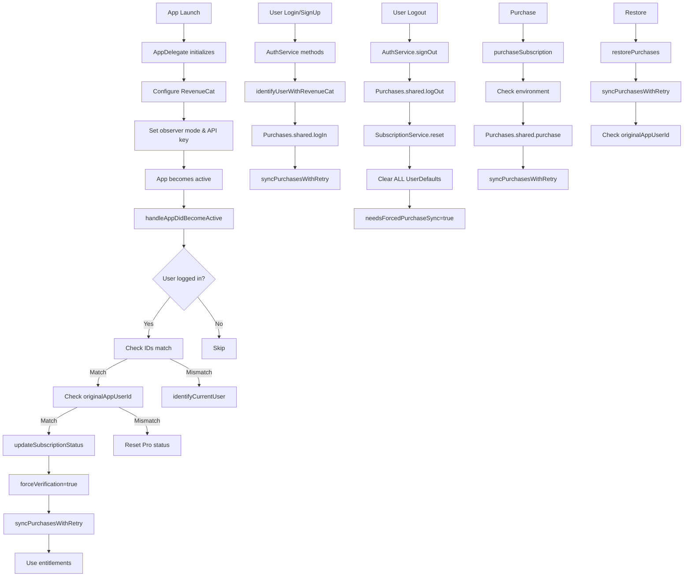

# RevenueCat Integration Flow Diagram

This diagram shows the complete flow of RevenueCat integration in the 100Days app, including:

1. App initialization and configuration
2. User authentication flows (login/logout)
3. Purchase and restore processes
4. Subscription verification mechanisms

## Key Implementation Points

1. **User Identity Management**

   - Firebase UID is used as RevenueCat's user identifier
   - Original purchaser verification happens at multiple points
   - Complete reset of state on user switching

2. **Receipt Syncing Strategy**

   - Robust `syncPurchasesWithRetry` with exponential backoff
   - Multiple retry attempts for network failures
   - Explicit sync after login, purchase, and restore

3. **Environment Verification**

   - Sandbox vs. production receipt checking
   - Bundle ID verification
   - Detailed logging of all receipt operations

4. **State Isolation**
   - Complete UserDefaults clearing
   - Force verification on app resume
   - Subscription cache invalidation
